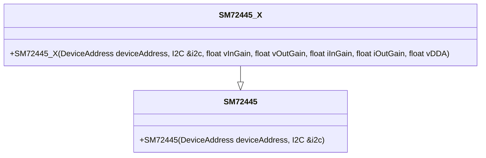
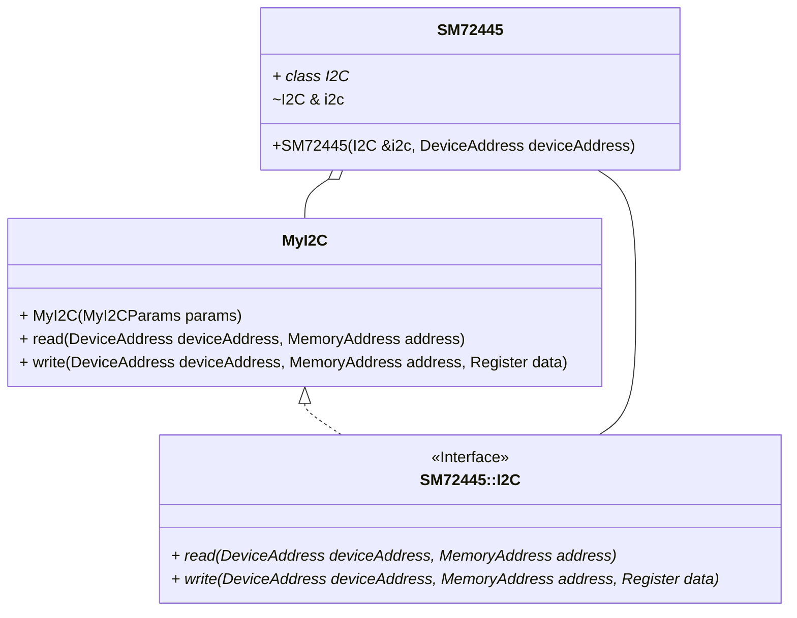

# SM72445 Photovoltaic MPPT Controller Driver

## Overview

The SM72445 is an embedded photovoltaic MPPT controller, produced by Texas Instruments (and formerly National Semiconductor), and operates with an analogue interface with the option of digital overriding. This driver provides a simple C++ object-orientated driver to allow for control and data reception from this device, and is agnostic to any embedded platform.

The design philosophy of this driver is comparatively unique in the embedded systems space. The object orientated approach results in a simple, scalable, and extensible driver, which is easy to use and understand. The driver is also designed to be agnostic to any embedded platform, and is therefore portable to any embedded system, with any I2C implementation (see [Design Patterns](#design-patterns)). The system also adopts strong unit testing with the [Google Test](https://google.github.io/googletest/) framework, allowing for a high degree of confidence in the driver's operation and ease of further development. CMake also allows for easy integration into parent projects.

## Objects

Two main driver objects are provided, `SM72445` and `SM72445_X`. The former is a "bare-bones" foundation providing basic functionality, while the latter is the "extended" version, inheriting all functionality from the former and adding an extended interface.



| Feature               | [`SM72445`](Inc/SM72445.hpp) | [`SM72445_X`](Inc/SM72445_X.hpp) |
| :-------------------- | :--------------------------: | :------------------------------: |
| Register Structures   |             Yes              |               Yes                |
| Floating Operations   |              No              |               Yes                |
| Electrical Units      |              No              |         Yes (V, A, etc.)         |
| Real Telemetry Values |              No              |               Yes                |
| Configuration Builder |              No              |               Yes                |

## How to Use

1. Add this project as a `git submodule`.

    ```zsh
    git submodule add https://github.com/LawrenceStanton/SM72445 Modules/SM72445
    ```

2. Build with CMake by adding as a subdirectory.

    ```cmake
    # Add to Your Top-Level CMakeLists.txt
    add_subdirectory(Modules/HDC1080)
    # ...
    target_link_libraries(${YOUR_EXECUTABLE_NAME} PRIVATE 
        SM72445::SM72445
    )    
    ```

    > If you are not using CMake, you must then simply clone this repository and add the SM72445 include directory and source files to your chosen build system as desired.

3. Provide an I2C interface when constructing the driver. Refer to [Design Patterns](#design-patterns) below and [SM72445.hpp](Inc/SM72445.hpp) for more information.

4. Construct the SM72445 I2C interface and class object.

    ```cpp
    // Construct the I2C interface
    MyI2C i2cInterface(myParams);
    // Construct the SM72445 class object
    SM72445::SM72445 mppt(&i2cInterface);
    ```

    > Ensure that the I2C interface is not destroyed while the SM72445 class object is still in use!

## Design Patterns

This driver follows an [Strategy Design Pattern](https://en.wikipedia.org/wiki/Strategy_pattern) with regards to the I2C communication. The driver defines an I2C interface (`SM72445::I2C`). The user must then provide a concrete implementation of this interface, and provide it to the driver class.



Often a concrete implementation will simply translate the I2C operations to the embedded platform's Hardware Abstraction Layer (HAL). For example, the [STM32Cube HAL](https://www.st.com/en/embedded-software/stm32cube-mcu-mpu-packages.html) provides an I2C interface, which can be used to implement the I2C operations. However, the user may also provide their own low level implementation, which may be useful in some applications, or a mocked implementation, which may be useful for testing purposes (see [Testing](#testing)).

> Take careful note of the API instructions when implementing the I2C interface, as the SM72445 itself is not well documented with regard to the I2C interface.

### Example

Below is an example of a typical declaration of a user's I2C interface.

```cpp
#include "SM72445.hpp"

class MyI2C : public SM72445::I2C {
public:
    MyI2C(MyI2CParams params) : params(params) {}
    virtual ~MyI2C() = default; // virtual necessary if driver object is ever deleted!

    virtual std::optional<Register> read(DeviceAddress deviceAddress, MemoryAddress address) override final;
    virtual std::optional<Register> write(DeviceAddress deviceAddress, MemoryAddress address, Register) override final;
};
```

## Error Handling

By default, this driver operates on a no-exception basis, as is commonly required for embedded applications.

When possible, failures may result in a known safe default return value. e.g. setting the output voltage to a negative value will result in zero volts being set instead. This practise is limited however to cases where such action is deemed safe and the issue will be immediately obvious.

In all operations that involve communication with the SM72445, this driver uses `std::optional` wrapper to return the communication result. This is done to allow for the possibility of a read or write operation failing. Admittedly, `std::expected` would be a better choice, but this is not available until C++20, which as of writing is not yet fully supported by GCC. The wrapped value is either the data read from the SM72445, or the data written to the SM72445, depending on the operation.

> If more sophisticated error handling is required, this may be injected via the I2C interface where the user may call their own error handing function (see [Design Patterns](#design-patterns)).

## Testing

This driver is designed to be tested using the [Google Test](https://google.github.io/googletest/) framework. The tests are located in the [Tests](Tests) directory, and can be run using CMake.

```zsh
mkdir build && cd build
cmake ..
cmake --build .
ctest
```

Given the limitations of many embedded systems; the tests are designed to be run on a host machine, rather than on the embedded platform itself. This is done by checking the `CMAKE_CROSSCOMPILING` variable, and if false, the tests are compiled for the host machine. If crosscompiling, the tests are not built.

The tests will be included in the parent build if ctest is also used there.
